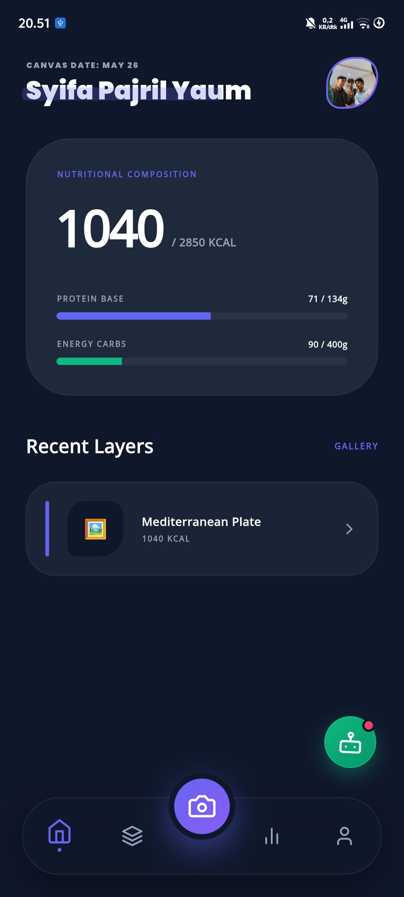
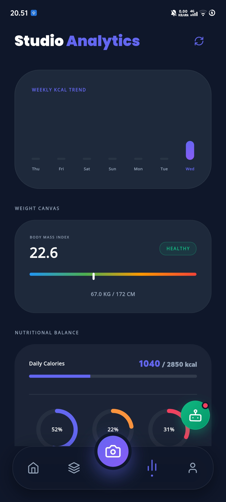
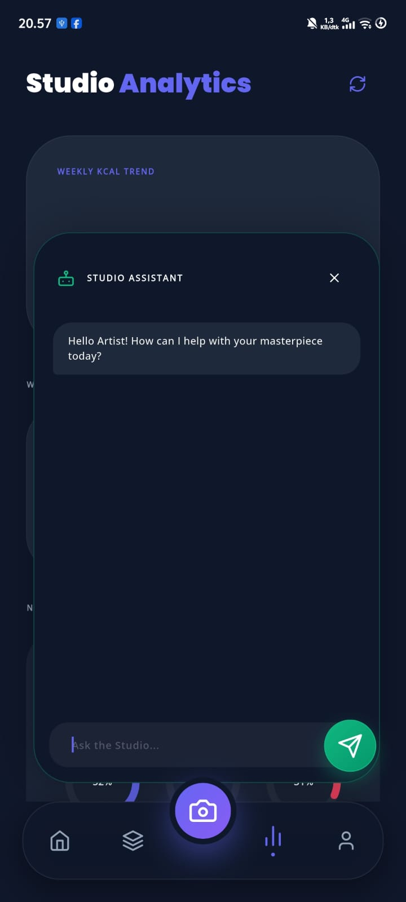
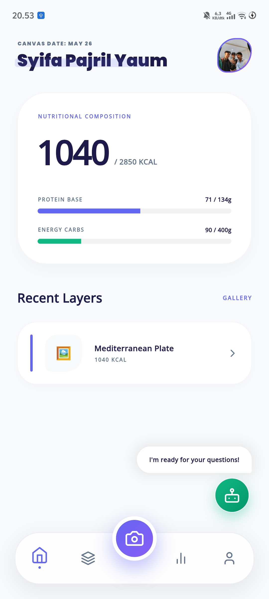
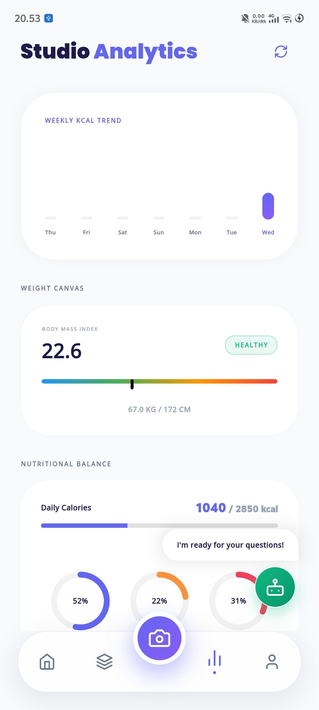
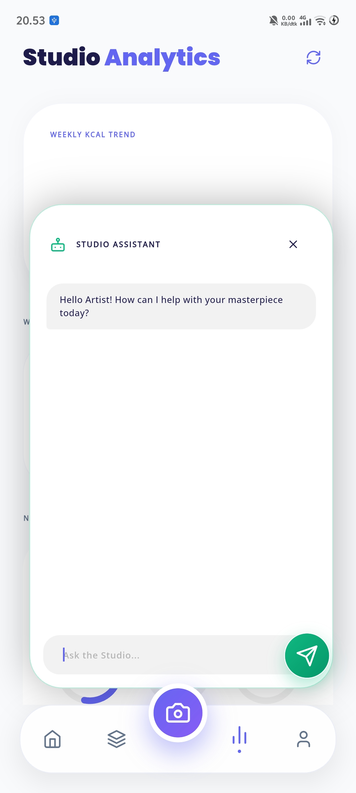

<div align="center">

# 🎨 CANVAS
### Computerized Automated Nutrition & Volume Analysis System

[](https://flutter.dev)
[](https://supabase.com)
[](https://ai.google.dev)
[](https://creativecommons.org/licenses/by/4.0/)

**Revolutionizing nutritional tracking through computer vision and artistic precision.**

---

[**Overview**](#-overview) • [**Key Features**](#-key-features) • [**The Gallery**](#-the-studio-gallery) • [**ML Engine**](#-machine-learning--data) • [**License**](#-license--citation)

</div>

## 🌟 Overview

**CANVAS** is an elite multimodal automated nutrition tracking system designed to eliminate the friction of manual data entry. By adapting the cutting-edge methodology from the **Nutrition5k** research, CANVAS predicts caloric and macronutrient values directly from real-world food imagery with a target precision that outperforms human visual estimation by over 50%.

## ✨ Key Features

### 🚀 Dual-Engine Smart Scanner
*   **Flagship Mode:** Leverages physical depth sensors (LiDAR) for high-precision scalar volume calculation (Target MAE ~16.5%).
*   **Standard Mode:** Utilizes 2D regression models and multi-view reconstruction for generic devices (Target MAE ~26.1%).

### 🤖 Studio Assistant (AI Bot)
Integrated **Gemini 2.5 Flash** agent that provides real-time, personalized nutritional coaching based on your current physical metadata and daily consumption logs.

### 📊 Artistic Analytics
Dynamic weekly trends and nutritional composition canvases that visualize your journey with a premium aesthetic.

---

## 🖼️ The Studio Gallery

### 🌑 The Dark Canvas (OLED Optimized)
*Experience deep blacks and vibrant neon accents, designed for high-end mobile displays.*

<p align="center">
  
  
  
</p>

### ☀️ The Light Canvas (Studio Clean)
*A minimalist and airy aesthetic, focusing on clarity and daylight readability.*

<p align="center">
  
  
  
</p>

---

## 🧠 Machine Learning & Data

CANVAS utilizes the **Nutrition5k Dataset** for training its regression models. This massive dataset provides the ground truth for realistic food scanning.

*   **Dataset Size:** ~181.4 GB
*   **Contents:** 5,006 plates, overhead RGB-D images, rotating side-angle videos, and per-ingredient mass/macronutrients.
*   **Regression Target:** Multi-task head predicting Calories, Total Mass, Protein, Carbs, and Fat.

### Download Nutrition5k
```bash
# Using gsutil to clone the dataset
gsutil -m cp -r "gs://nutrition5k_dataset/nutrition5k_dataset/" .
```

---

## 🛠️ Technical Stack

- **Frontend:** Flutter (Business Logic Component / BLoC)
- **Backend:** Supabase (PostgreSQL, Auth, Storage)
- **AI Core:** Google Generative AI (Gemini 2.5 Flash)
- **Image Engine:** Custom background isolates for 60FPS responsiveness.
- **Automation:** Appium + WebdriverIO (E2E Testing).

---

## 📜 Acknowledgements & Citations

This project stands on the shoulders of giants. CANVAS is built upon and inspired by the **Nutrition5k** dataset and research methodology open-sourced by Google Research. 

### Nutrition5k Dataset License
The visual and nutritional data from Nutrition5k used during our development phase is distributed under the [Creative Commons Attribution 4.0 International (CC BY 4.0)](https://creativecommons.org/licenses/by/4.0/) license. 

We highly appreciate and credit the authors for promoting research in visual nutrition understanding:

```bibtex
@inproceedings{thames2021nutrition5k,
  title={Nutrition5k: Towards Automatic Nutritional Understanding of Generic Food},
  author={Thames, Quin and Karpur, Arjun and Norris, Wade and Xia, Fangting and Panait, Liviu and Weyand, Tobias and Sim, Jack},
  booktitle={Proceedings of the IEEE/CVF Conference on Computer Vision and Pattern Recognition},
  pages={8903--8911},
  year={2021}
}
```
---
---

<p align="center">
  Developed by @jrilym the <a href="https://github.com/timbubadibako"><b>Timbubadibako's<b>
</p>
<p align="center">
  <a href="https://ko-fi.com/timbubadibako">
    
  </a>
</p>